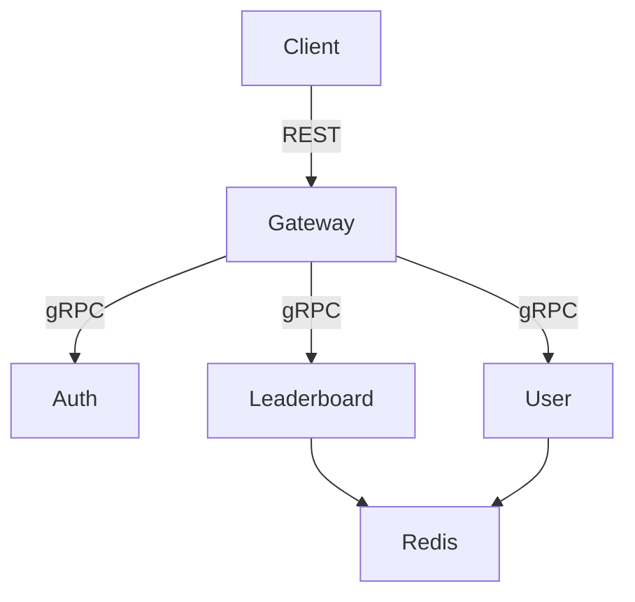

📄 RankRun

RankRun은 Go, Fiber, gRPC, Redis 기반으로 구현된 실시간 리더보드 시스템입니다.
사용자는 점수를 기록하고, 시스템은 이를 Redis Sorted Set을 이용해 실시간으로 랭킹에 반영합니다.
서비스는 MSA 구조로 구성되며, API Gateway를 통해 인증된 사용자만 점수를 기록하고 순위를 조회할 수 있습니다.

이 프로젝트는 Minikube 기반 Kubernetes 환경에서 배포 가능하도록 설계되었습니다.

⸻

📘 README.md

# 🏆 RankRun

Go + Fiber + gRPC + Redis 기반 실시간 리더보드 시스템  
실행 환경: Kubernetes (Minikube)

---

## 📌 주요 기능

- 사용자 등록 및 로그인
- JWT 기반 인증
- 점수 기록 및 갱신
- 상위 랭커 조회
- 사용자 개별 순위 조회

---

## 🧱 시스템 아키텍처

⸻

🧩 서비스 구성

서비스	설명
Gateway	REST API 진입점 (Fiber), JWT 인증, 각 gRPC 서비스 라우팅
Auth	로그인, JWT 발급, 토큰 검증
User	사용자 등록, 사용자 ID ↔ 이름 매핑
Leaderboard	점수 기록 및 랭킹 조회 (Redis Sorted Set 기반)

⸻

🧑‍💻 제작자
	•	작성자: sangjinsu
	•	Contact: sangjinsu9@gmail.com or climbplant39@kakao.com

---
